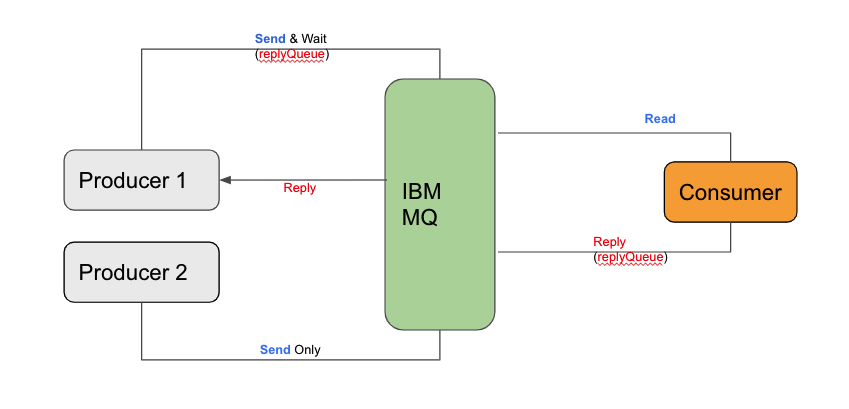
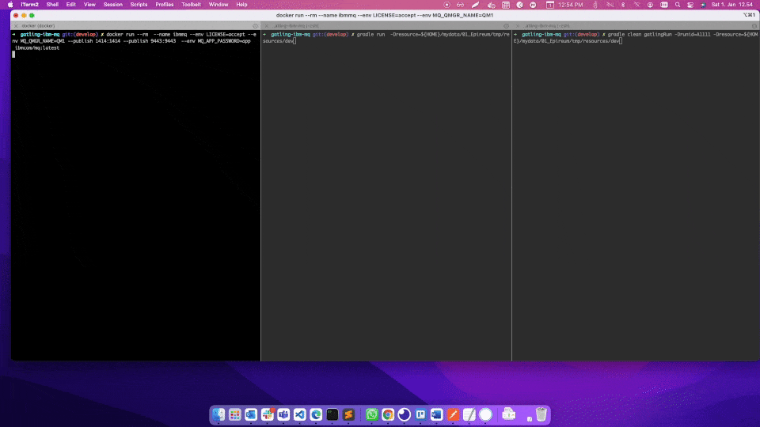

# About this project

This project allows to send message to IBM MQ as part of load test using JMS and JNDI connections. Example configuration in this project use IBM MQ running in dockers to send message.

This project was build using **gradle**. You might need to install gradle and java.

# Features

- Allows to configure multi queue
- Consumer
- Supports replyTo
- Templating messages
- feed data from input file
- Dynamic scenario configuration using configuration file
- Helps shift-left methods to quickly run messages to IBM MQ

# Supported Scenario




Note:  Can configure **n** number of producers and consumers
 
# How to Run

## Configure Resource folder


### For producer (Gatling)

- copy [resource](./resource) folder from repo root to your  own project directory (ex: <USER_HOME>/project)
- For producer (gatling) , add mq details in [mq.json](./resource/mq.json) file
- Copy message file in payload directory (ex: [input.xml](./resource/payload/input.xml)  ) and add relative path of the file in [mq.json](./resource/mq.json) . Check the example in [mq.json](./resource/mq.json) 

### For Consumer

- For consumer, add mq details in [mq.props](./resource/mq.props) . Optional until other it is required.
- copy reply message to payload directory (ex: [output.xml](./resource/payload/input.xml) ) and relative path of the file in mq.props. Check the example in [mq.props](./resource/mq.props)
- (Optional) For correlation on received message in XML format, update [xpath.props](./resource/xpath.props)  with xpath. Check example in [xpath.props](./resource/xpath.props)


# Manual Execution

If you do not have IBM MQ details already, Follow below steps to create IBM MQ locally and use predefined configuration in [resource](./resource) folder. If you have IBM MQ details already , read Run Producer(Gatling) section  after resource folder is configured.

## Run IBM MQ in dockers

To run this project locally, you need IBM MQ running. Run IBM docker using below command.
```
docker run --name ibmmq --env LICENSE=accept --env MQ_QMGR_NAME=QM1 --publish 1414:1414 --publish 9443:9443 --env MQ_APP_PASSWORD=app ibmcom/mq:latest
```

## Open IBM MQ
https://localhost:9443/
```
username: admin
password: passw0rd
```
Navigate to Manage -> Local Queue Manager -> QM1 -> DEV.QUEUE.1

## Run Producer (Gatling)

By default test runs for 1 min
```
./gradle clean gatlingRun # To use default configuration (Only for testing purpose)
./gradle clean gatlingRun -Drunid=A1111 -Dresource=<USER_HOME>/project/resource # To use the resource folder created under project directory
```

To run test for 1 hour
```
./gradle gatlingRun -DmaxDuration=60 -Drunid=A1111 -Dresource=<USER_HOME>/project/resource
```

## Run Consumer
You need to run consumer to use default configuration in this project.
To run Consumer

```
./gradle run # To use default configuration (Only for testing purpose)
gradle run -Dresource=<USER_HOME>/project/resource # To use the resource folder created under project directory
```

## Demo


 
# Using docker-compose Execution
After configuring the files, run docker-compose as below
```
docker-compose up --build --abort-on-container-exit
```
To stop test before complete, use 

```
docker-compose down
```

# Results
Results are located in ${PWD}/build/reports/gatling/basicsimulation-xxxxxxx/index.html
  
# MQ.JSON Configuration (Producer)


## Direct Connection to MQ
For direct connection , we need following details from MQ
- HOST
- PORT
- QueueName
-  Channel
- Username (if required)
- Password (if required)
- replyQueue (if producer wait to get response back as sync)
- replyValidator (validate message with text check)

### Sample configuration
```
{
	"mq1": {
		"host" : "localhost",
		"port" : 1414,
		"queueManager" : "QM1",
		"channel" : "DEV.APP.SVRCONN",
		"queueName" : "DEV.QUEUE.1",
		"replyQueue" : "DEV.QUEUE.2",  // default example use replyQueue
		"replyValidator" : "employee", // response message expecated contain 'employee' text
		"authUser" : "app",
		"authPassword" : "app",
		"bindingPath" : "",
		"feeder" : "./users.csv",
		"payload" : "./payload/input.xml",
		"users" : 1,
		"thinktime" : 2
	}
}
```
## JNDI Based Configuration
For jndi based configuration, we need following details from MQ
- .binding file
- QueueName (do not use alias name. Check the binding file for real queue name) 

### Sample configuration
```
{
	"mq1": {
		"host" : "",
		"port" : 0,
		"queueManager" : "",
		"channel" : "",
		"queueName" : "DEV.QUEUE.1",
		"replyQueue" : "",
		"replyValidator" : "",
		"authUser" : "",
		"authPassword" : "",
		"bindingPath" : "./bindings/RT", # location of .binding file under resource folder
		"payload" : "./payload/input.xml",
		"users" : 1,
		"thinktime" : 2
	}
}
```

## Multi Queue Configuration

Producer allow to configure as many IBMMQ as we like. Here is the example with two items

```
{
	"mq1": {
		"host" : "",
		"port" : 0,
		"queueManager" : "",
		"channel" : "",
		"queueName" : "DEV.QUEUE.1",
		"replyQueue" : "",
		"replyValidator" : "",
		"authUser" : "",
		"authPassword" : "",
		"bindingPath" : "./bindings/RT", # location of .binding file under resource folder
		"payload" : "./payload/input.xml",
		"users" : 1,
		"thinktime" : 2
	},
	"mq2": {
		"host" : "localhost",
		"port" : 1414,
		"queueManager" : "QM1",
		"channel" : "DEV.APP.SVRCONN",
		"queueName" : "DEV.QUEUE.1",
		"replyQueue" : "",
		"replyValidator" : "",
		"authUser" : "app",
		"authPassword" : "app",
		"bindingPath" : "",
		"payload" : "./payload/input.xml",
		"users" : 1,
		"thinktime" : 2
	}
}
```

# MQ.PROP Configuration (Consumer)


## With ReplyQueue

```
MQ_HOST=localhost(1414)
CHANNEL=DEV.APP.SVRCONN
QMGR=QM1
APP_USER=app
APP_PASSWORD=app
READ_QUEUE=DEV.QUEUE.1
WRITE_QUEUE=DEV.QUEUE.2 // if defined, JMSReplyQueue override with this value
PAYLOAD=payload/output.xml 
```

## Without ReplyQueue
 
 ```
MQ_HOST=localhost(1414)
CHANNEL=DEV.APP.SVRCONN
QMGR=QM1
APP_USER=app
APP_PASSWORD=app
READ_QUEUE=DEV.QUEUE.1
WRITE_QUEUE=  // Leave empty to read reply Queue from the incoming message
PAYLOAD=payload/output.xml 
```

# Message Templating

Currently following placeholders are supported. Always check for the latest code for more placeholders. 

- [X] _UUID_ -> To get UUID Example: 9802139069434EE2B1B36266FD1BCF59
- [X] _RAND_STR6_ -> Random string of 6 characters. Example :eredce
- [X] _RAND_STR8_ -> Random string of 8 characters. Example :eredceww
- [X] _CURRENT_DT_ISO_ -> Current Date time in ISO format Example: 2021-12-24T22:26:54
- [X] _CURRENT_TS_ -> Current unix timestamp Example : 1640378409
- [X] _RAND_INT4_ -> Rand Interger in the range Example: 3492
- [X] _RAND_INT6_ -> Rand Interger in the range Example: 209223
- [X] _RAND_INT8_ -> Rand Interger in the range Example: 20922322
- [X] _RUNID_ -> unix timestamp. Once Only per test. Example : 1640378409
- [X] _DATE_ -> Only today date in YYYY-MM-DD. Example : 2021-12-24
- [X] _TIME_ -> Only current time in HH:MM:SS. Example : 12:12:12

 
 ## How to use templating 
 We might need to send a dynamic data (like message id , date etc) with the payload. Templating allows to configure payload with dynamic data.  Lets say message  should contain unique email address 

```
<?xml version="1.0" encoding="UTF-8"?>
<note>
	<id>AF12221GG7DF</id>
	<to>to-user1@example.com</to>
	<from>from-user1@example.com</from>
	<heading>Reminder</heading>
	<phone>9383737474</phone>
</note>
```
Using above templating option, prepare the input.xml message as below
```
<?xml version="1.0" encoding="UTF-8"?>
<note>
	<id>_UUID_</id>
	<to>to-_RAND_STR8_@example.com</to>
	<from>from-_RAND_STR8_@example.com</from>
	<heading>Reminder</heading>
	<phone>_RAND_INT8_</phone>
</note>
```
Final message send to the Queue
```
<?xml version="1.0" encoding="UTF-8"?>
<note>
	<id>9802139069434EE2B1B36266FD1BCF59</id>
	<to>to-eredceww@example.com</to>
	<from>from-eredceww@example.com</from>
	<heading>Reminder</heading>
	<phone>20922322</phone>
</note>
```


### Data from freeder

We can populate data to payload using  external files. Define the file from which you want to randomly pick the data.

```
{
	"mq1": {
		.
		.
		.
		"feeder": "./users.csv",
		"users" : 1,
		"thinktime" : 2
	}
}

users.csv
----------
_USERNAME_,_PASSWORD_
test1,test1
test2,test2

Templating:
-----------

<?xml version="1.0" encoding="UTF-8"?>
<note>
	<id>_UUID_</id>
	<username>_USERNAME_</usernmae>  // A random value from  feeder file
	<to>to-_RAND_STR8_@example.com</to>
	<from>from-_RAND_STR8_@example.com</from>
	<heading>Reminder</heading>
	<phone>_RAND_INT8_</phone>
</note>

```


For **Consumer** templating, use ${} format. Example ${UUID}

```
<?xml version="1.0" encoding="UTF-8"?>
<note>
	<id>${UUID}</id>
	<to>to-${RAND_STR8}@example.com</to>
	<from>from-${RAND_STR8}@example.com</from>
	<heading>Reminder</heading>
	<phone>${RAND_INT8}</phone>
</note>
```

## Correlation on incoming message in consumer

### XPATH correlation

[xpath.props](./resource/xpath.props) provides correlation on incoming messages. Define xpath correlations and assing to the variable
```
VAR1=/note/id/text()
VAR2=/note/from/text()
```
VAR1 and VAR2 hold the values of incoming message.  Use the VAR1 and VAR2 placeholders in [output.xml](./resource/payload/output.xml)

```
<employees>
    <employee id="${VAR1}">
        <firstName>${VAR1}</firstName>
        <lastName>${VAR2}</lastName>
        <location>${UUID}</location>
    </employee>
</employees>
```

Final message send to replyQueue 

```
<employees>
    <employee id="9802139069434EE2B1B36266FD1BCF59">
        <firstName>9802139069434EE2B1B36266FD1BCF59</firstName>
        <lastName>from-eredceww@example.com</lastName>
        <location>E802139069434EE2B1B36266FD1BCF99</location>
    </employee>
</employees>
```

# References

https://javadoc.io/doc/io.gatling/gatling-jms/latest/io/gatling/jms/action/index.html
